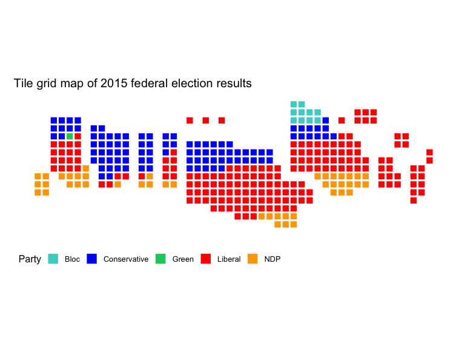
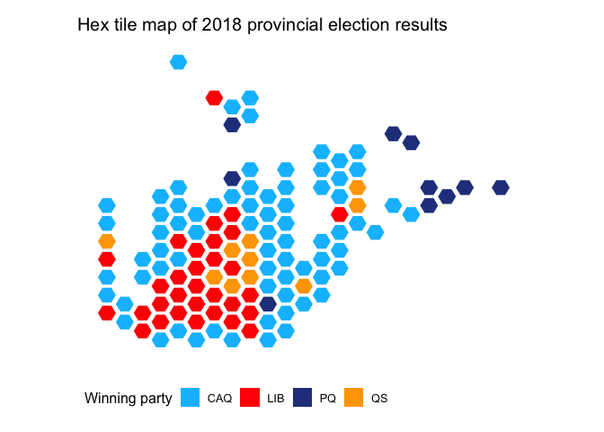
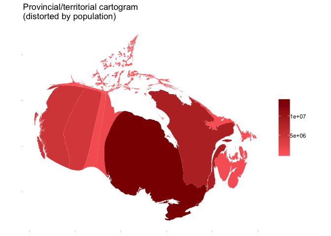

<!-- README.md is generated from README.Rmd. Please edit that file -->
mapcan
======

`mapcan` is an R package that provides convenient tools for plotting a variety of Canadian maps with the `ggplot2` package.

Tile grid map of Canadian federal electoral ridings
---------------------------------------------------

2015 Canadian federal election results
--------------------------------------

2015 Canadian federal election results
--------------------------------------

### Cartogram distorted by population

