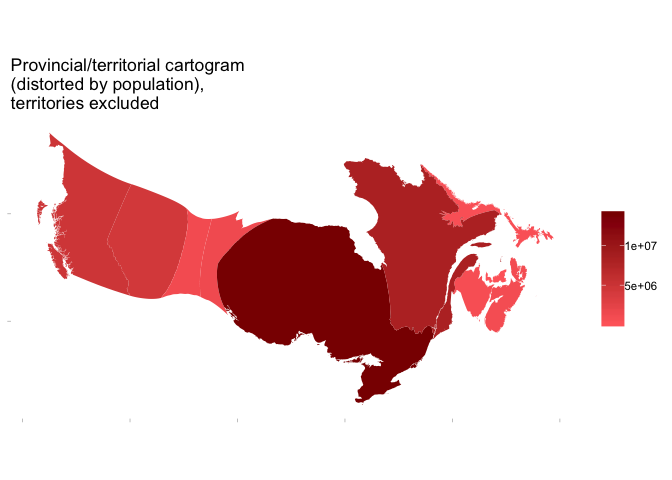
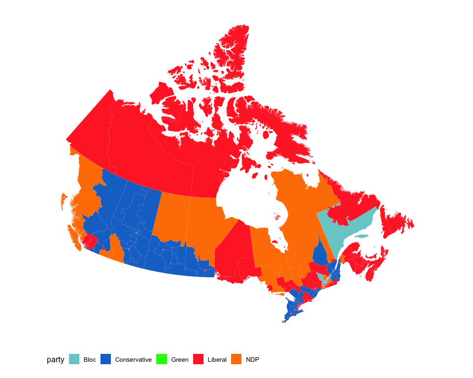

<!-- README.md is generated from README.Rmd. Please edit that file -->
mapcan
======

`mapcan` is an R package that provides convenient tools for plotting a variety of Canadian maps with the `ggplot2` package.

    #> Warning: package 'tidyverse' was built under R version 3.4.2
    #> ── Attaching packages ────────────────────────────────────────────────────────────────────────────────────────────── tidyverse 1.2.1 ──
    #> ✔ tibble  1.4.2     ✔ purrr   0.2.5
    #> ✔ tidyr   0.8.1     ✔ dplyr   0.7.6
    #> ✔ readr   1.1.1     ✔ stringr 1.3.1
    #> ✔ tibble  1.4.2     ✔ forcats 0.3.0
    #> Warning: package 'tibble' was built under R version 3.4.3
    #> Warning: package 'tidyr' was built under R version 3.4.4
    #> Warning: package 'purrr' was built under R version 3.4.4
    #> Warning: package 'dplyr' was built under R version 3.4.4
    #> Warning: package 'stringr' was built under R version 3.4.4
    #> Warning: package 'forcats' was built under R version 3.4.3
    #> ── Conflicts ───────────────────────────────────────────────────────────────────────────────────────────────── tidyverse_conflicts() ──
    #> ✖ dplyr::filter() masks stats::filter()
    #> ✖ dplyr::lag()    masks stats::lag()
    #> Warning: package 'paletteer' was built under R version 3.4.4
    #> Warning: package 'scales' was built under R version 3.4.4
    #> 
    #> Attaching package: 'scales'
    #> The following object is masked from 'package:purrr':
    #> 
    #>     discard
    #> The following object is masked from 'package:readr':
    #> 
    #>     col_factor
    #> Warning: package 'gridExtra' was built under R version 3.4.1
    #> 
    #> Attaching package: 'gridExtra'
    #> The following object is masked from 'package:dplyr':
    #> 
    #>     combine

Tile grid map of Canadian federal electoral ridings
---------------------------------------------------

2015 Canadian federal election results
--------------------------------------

Provincial/territorial cartogram
--------------------------------

 \#\# Census division cartograms 
