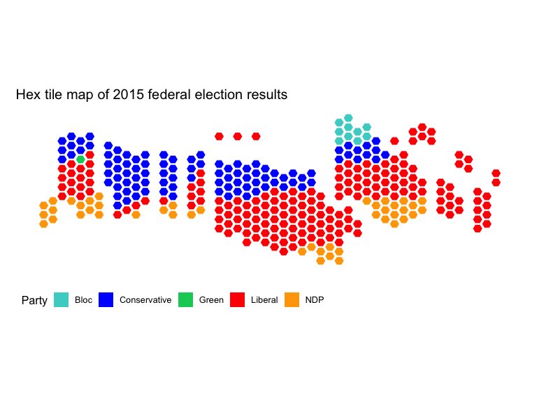
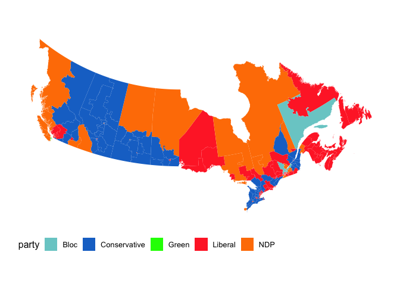
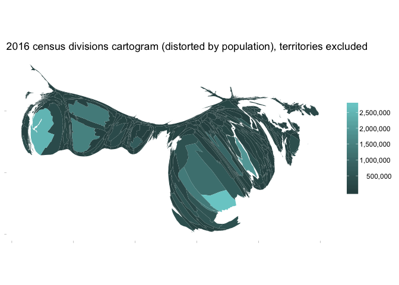

<!-- README.md is generated from README.Rmd. Please edit that file -->
mapcan
======

`mapcan` is an R package that provides convenient tools for plotting a variety of Canadian maps with the `ggplot2` package.

Using mapcan
============

`mapcan` data are best utilized with `ggplot2`

``` r
library(mapcan)
library(ggplot2)
library(tidyverse)
#> Warning: package 'tidyverse' was built under R version 3.4.2
#> ── Attaching packages ────────────────────────────────────────────────────────────────────────────────────────────────────────────────── tidyverse 1.2.1 ──
#> ✔ tibble  1.4.2     ✔ purrr   0.2.5
#> ✔ tidyr   0.8.1     ✔ dplyr   0.7.6
#> ✔ readr   1.1.1     ✔ stringr 1.3.1
#> ✔ tibble  1.4.2     ✔ forcats 0.3.0
#> Warning: package 'tibble' was built under R version 3.4.3
#> Warning: package 'tidyr' was built under R version 3.4.4
#> Warning: package 'purrr' was built under R version 3.4.4
#> Warning: package 'dplyr' was built under R version 3.4.4
#> Warning: package 'stringr' was built under R version 3.4.4
#> Warning: package 'forcats' was built under R version 3.4.3
#> ── Conflicts ───────────────────────────────────────────────────────────────────────────────────────────────────────────────────── tidyverse_conflicts() ──
#> ✖ dplyr::filter() masks stats::filter()
#> ✖ dplyr::lag()    masks stats::lag()
library(paletteer)
#> Warning: package 'paletteer' was built under R version 3.4.4
```

Tile grid map of Canadian federal electoral ridings
---------------------------------------------------


``` r
ggplot(federal_riding_bins[federal_riding_bins$representation_order == 2003, ], aes(x = y, y = x, fill = pr_alpha)) +
  geom_raster() +
  geom_tile(colour = "white", size = 1.5, fill = NA) +
  paletteer::scale_fill_paletteer_d("ggthemes", "tableau_greenorange12") +
  coord_fixed() +
  scale_y_reverse() +
  theme_light()  +
  theme(panel.grid = element_blank(),
        panel.border = element_blank(),
        axis.text = element_blank(), 
        axis.title = element_blank(),
        legend.position = "bottom") +
  guides(fill = guide_legend(keywidth = 0.6, keyheight = 0.3,
                             nrow = 1, title = NULL)) +
  ggtitle("Canadian federal electoral ridings (2003 representation order)")
```



2015 Canadian federal election results
--------------------------------------


Provincial/territorial cartogram
--------------------------------

 \#\# Census division cartograms 
