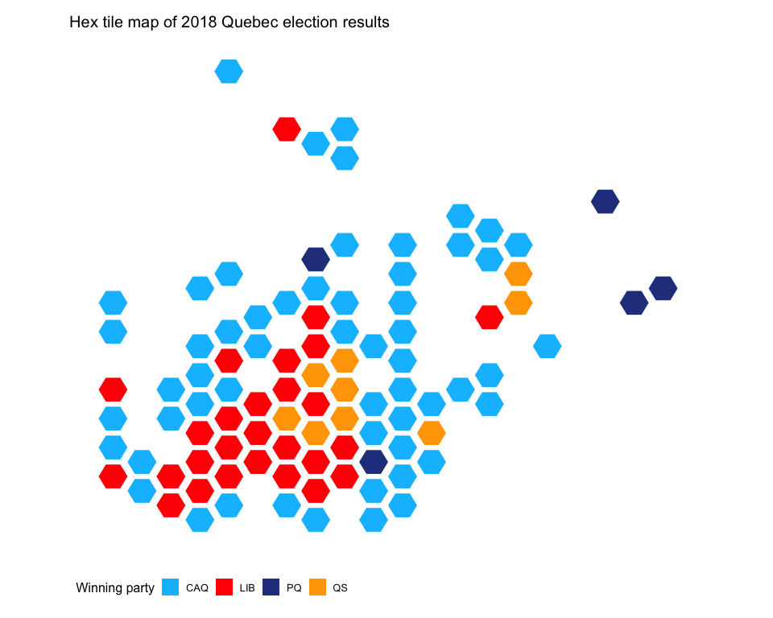
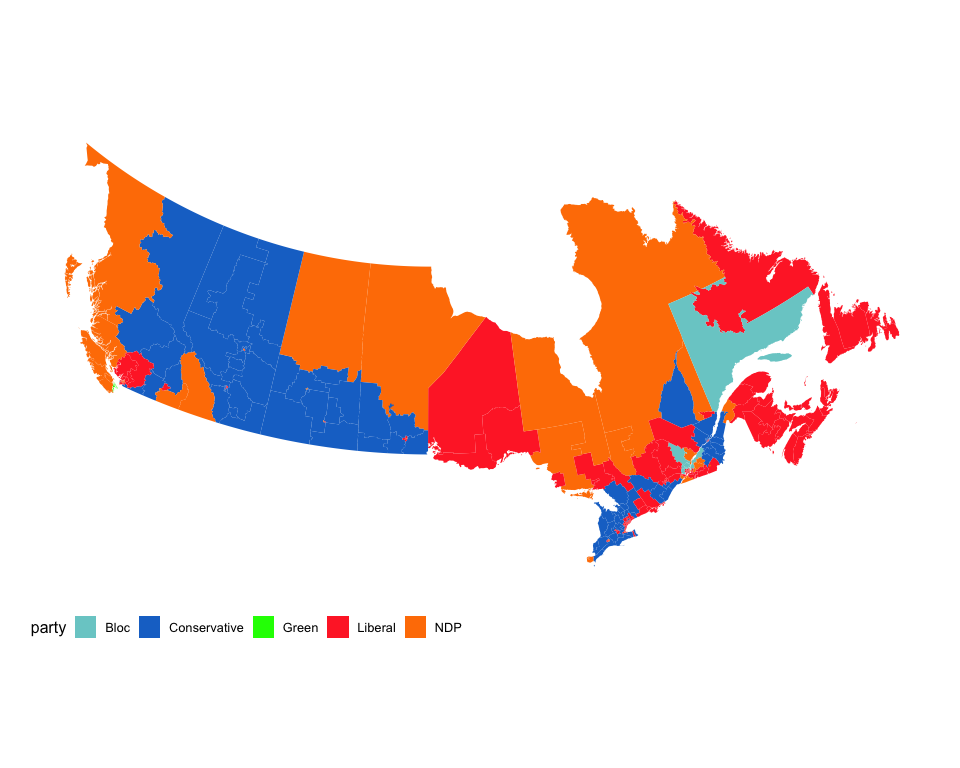
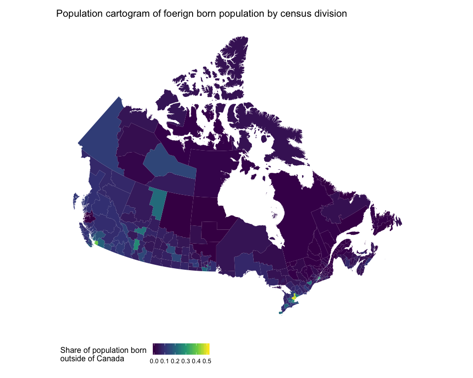

<!-- README.md is generated from README.Rmd. Please edit that file -->
mapcan
======

`mapcan` is an R package that provides convenient tools for plotting Canadian choropleth maps and choropleth alternatives.

Installing mapcan
-----------------

`library(devtools)`

`install_github("mccormackandrew/mapcan", build_vignettes = TRUE)`

I suggest that you pass the `build_vignettes = TRUE` to `install_github()`. The vignettes provide detailed guides on how `mapcan`'s functions operate.

Using mapcan
============

`mapcan` data are best utilized with `ggplot2`

``` r
library(mapcan)
library(tidyverse)
```

Tile grid map of Canadian federal electoral ridings
---------------------------------------------------

`riding_binplot()` can be used to create tile cartograms at federal and provincial riding levels (note that only Quebec provincial ridings are supported right now). Here is an example:

``` r
# Load data that will be plotted with riding_binplot 
fed2015 <- mapcan::federal_election_results %>%
  filter(election_year == 2015)

riding_binplot(riding_data = fed2015,
               # Use the party (winning party) varibale from fed2015
               value_col = party, 
               # Arrange by value_col within provinces
               arrange = TRUE,
               # party is a categorical variable
               continuous = FALSE) +
  # Change the colours to match the parties' colours
  scale_fill_manual(name = "Party",
                    values = c("mediumturquoise", "blue", "springgreen3", "red", "orange")) +
  # mapcan ggplot theme removes axis labels, background grid, and other unnecessary elements when plotting maps
  theme_mapcan() +
  ggtitle("Tile grid map of 2015 federal election results")
```


Perhaps you are averse to squares. That is ok. Try hexagons instead:

``` r
riding_binplot(riding_data = fed2015,
               # Use the party (winning party) varibale from fed2015
               value_col = party, 
               # Arrange by value_col within provinces
               arrange = TRUE,
               # party is a categorical variable
               continuous = FALSE,
               shape = "hexagon") +
  # Change the colours to match the parties' colours
  scale_fill_manual(name = "Party",
                    values = c("mediumturquoise", "blue", "springgreen3", "red", "orange")) +
  # mapcan ggplot theme removes axis labels, background grid, and other unnecessary elements when plotting maps
  theme_mapcan() +
  ggtitle("Hex tile map of 2015 federal election results")
```


Perhaps you are interested in provincial election results, not federal election results. That is also ok. Try plotting the Quebec 2018 provincial election results:

``` r
# Load data that will be plotted with riding_binplot 
riding_binplot(quebec_provincial_results,
               value_col = party,
               riding_col = riding_code, 
               continuous = FALSE, 
               provincial = TRUE,
               province = QC,
               shape = "hexagon") +
  theme_mapcan() +
  scale_fill_manual(name = "Winning party", 
                    values = c("deepskyblue1", "red","royalblue4",  "orange")) +
  ggtitle("Hex tile map of 2018 Quebec election results")
```



Standard choropleth maps
------------------------

The `mapcan()` function returns geographic coordinate data frames at census division, federal riding, and provincial levels.


Not interested in the territories? No problem.



Population cartograms
---------------------

`mapcan()` can also be used to plot population cartograms. Based on the geographic distribution of Canadians (most Canadians live near the US border and very few live in the north), these maps are highly distorted. Shading the census divisions by population size shows how the cartogram inflates divisions with larger populations (i.e. Vancouver, Edmonton, Calgary, Toronto, and Montreal all become larger).

``` r
# Census population data is included in the geographic data frame that mapcan() returns
census_cartogram_data <- mapcan(boundaries = census,
       type = cartogram)

ggplot(census_cartogram_data, aes(long, lat, group = group, fill = population_2016)) +
  geom_polygon() +
  scale_fill_viridis_c() +
  theme_mapcan() +
  coord_fixed() +
  ggtitle("Population cartogram of census division populations")
```


Let's plot the share of individuals born outside of Canada in each census division as a standard choropleth map then as a population cartogram.

``` r
# Get census born outside of Canada data to use with geographic data
census_immigrant_share <- mapcan::census_pop2016 %>%
  select(census_division_code, born_outside_canada_share)

# Get population cartogram geograpic data
census_choropleth_data <- mapcan(boundaries = census,
       type = standard)

# Merge together 
census_choropleth_data <- left_join(census_choropleth_data, census_immigrant_share)

ggplot(census_choropleth_data, aes(long, lat, group = group, fill = born_outside_canada_share)) +
  geom_polygon() +
  scale_fill_viridis_c(name = "Share of population born \noutside of Canada") +
  theme_mapcan() +
  coord_fixed() +
  ggtitle("Population cartogram of foerign born population by census division")
```



``` r
# Get population cartogram geograpic data
census_cartogram_data <- mapcan(boundaries = census,
       type = cartogram)

# Merge together 
census_cartogram_data <- left_join(census_cartogram_data, census_immigrant_share)

ggplot(census_cartogram_data, aes(long, lat, group = group, fill = born_outside_canada_share)) +
  geom_polygon() +
  scale_fill_viridis_c(name = "Share of population born \noutside of Canada") +
  theme_mapcan() +
  coord_fixed() +
  ggtitle("Population cartogram of foerign born population by census division")
```


Comparing these two maps, it is clear that the standard choropleth map visually understates the share of the population that is foreign born in Canada.
